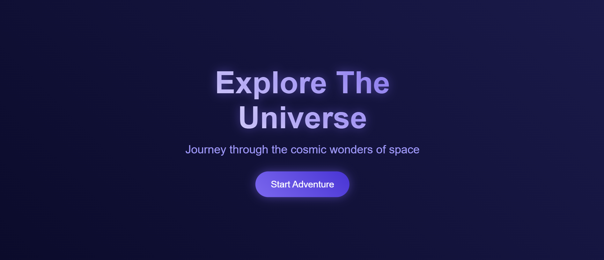

# Galaxy Explorer Landing Page

A beautiful and modern landing page inspired by the colors and wonders of the galaxy. This project is perfect for beginners learning HTML and CSS, and demonstrates how to create an attractive hero section with gradients, animated stars, and a call-to-action button.

## Features
- Galaxy-themed hero section with animated twinkling stars
- Gradient text and button effects
- Responsive and centered layout
- Clean, beginner-friendly HTML and CSS

## Preview
 <!-- Add a screenshot if you have one -->

## Getting Started
1. Clone this repository:
   ```sh
   git clone https://github.com/DanishCodex/galaxy-explorer-landing.git
   ```
2. Open the folder in your code editor.
3. Open `index.html` in your browser to view the landing page.

## Files
- `index.html` – Main HTML file
- `style.css` – CSS styles for the landing page

## License
This project is open source and free to use for learning and personal projects.